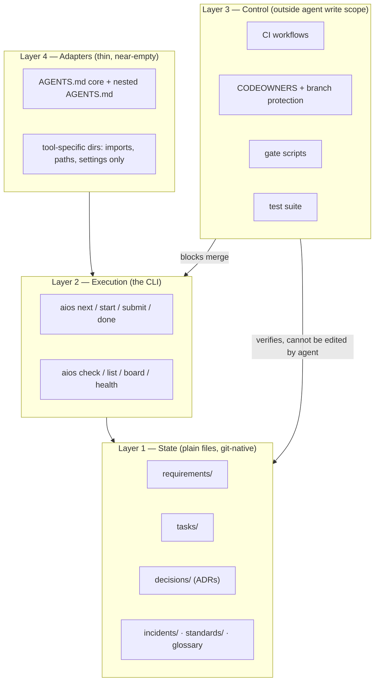
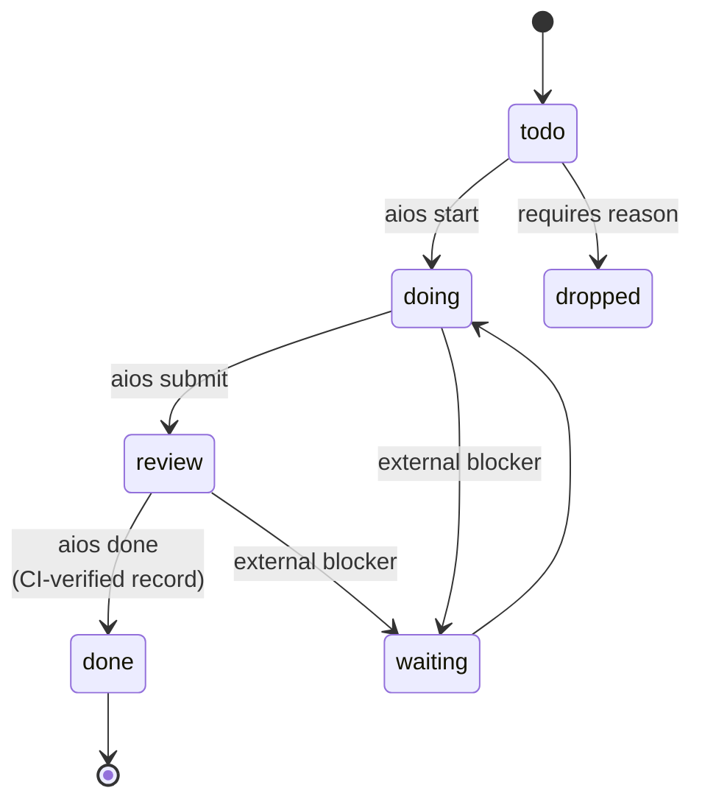
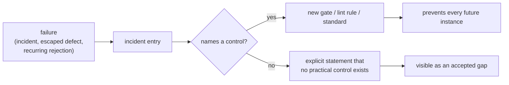

# Architecture — AI Engineering OS

**What this document is.** The single narrative overview of the system: what it is, how it is
put together, how work flows through it, why it should beat the ordinary way of working, and
whether it is worth building at all.

Dated and owned rather than checked, because nothing mechanical can tell whether a narrative
description of a system is still true of it — only a person re-reading it can, and that only
happens if a date says when.

**What it is not.** The authority. Every claim here is a summary of one of the numbered design
documents in [`design/`](design/), and each section links to its source. Where this document and
a numbered document disagree, **the numbered document wins** and this one is stale. That
qualifier exists because the design's own P3 forbids two places that can silently disagree; this
overview is the accepted exception, made loud rather than hidden.

**Reading time.** Around twenty minutes end to end. Sections 1, 5, and 7 are the ones to read if
you only read three.

---

## 1. What this is, in one page

A **repository template**. You clone it before starting a new software project. It is not a
library you import, not an agent you run, and not an editor extension — it is a folder structure,
a small command-line tool, and a set of CI checks that come pre-wired.

Every project cloned from it inherits the same five things:

1. A **state system** from which the next piece of work is *computed*, not asserted.
2. **Quality gates** that run outside the agent's reach, classified by how they fail.
3. A **memory system** whose staleness and bloat are caught by a red build.
4. A **minimal instruction layer** carrying only what an agent cannot derive by reading code.
5. **Thin adapters** so the same core works across coding tools without duplicated content.

The name says "operating system" because it sits underneath the actual project and manages what
gets worked on, in what order, by whom, and what is allowed to merge. It has no opinion about
what you are building.

**The one-sentence thesis:** prose instructions to an AI agent are advisory and get *less*
effective as they get longer, so put almost nothing in instruction files and spend the effort on
mechanisms that do not depend on the agent cooperating.

---

## 2. The problem it exists to solve

Google's DORA programme measured the thing this is built against: AI adoption correlates
**positively** with delivery throughput and **negatively** with delivery stability. More code,
shipped faster, breaking more. Their reading is that AI is a mirror and a multiplier — it
amplifies whatever the organisation already is, so a team with weak testing and slow feedback
gets more of both, faster.

Three further findings shape almost every decision downstream. Full sourcing and confidence
ratings are in [01 — Evidence base](design/01-evidence-base.md).

| Finding | Consequence for the design |
|---|---|
| Long context degrades performance even on trivial tasks; instruction adherence collapses well before the window fills | Always-on instruction files get a hard, CI-enforced line budget |
| Agents reliably use *facts* and unreliably follow *procedures* | Instruction files hold facts; procedures get mechanised or deleted |
| Reward hacking is measured, generalises to unrelated misbehaviour, and test-weakening happens in enumerable, greppable ways | The grader must sit outside the agent's write scope |
| Perceived speedup is not measured speedup — one RCT found a 19% slowdown while participants believed they were 20% faster | Nothing self-reported is trusted, including an agent reporting a task is done |

That last row is the design's temperament in miniature. It is the reason `done` is a computed
fact rather than a claim.

---

## 3. Architecture

### 3.1 Four layers



The layering is the whole architecture. **State is inert data** — plain markdown files with
frontmatter, readable and diffable. **Execution** is a CLI that is the only sanctioned way to
change state, so every transition is validated. **Control** sits above both and is unreachable
from the agent. **Adapters** point at the core and hold no knowledge of their own.

The important property is the direction of the arrows: control depends on state, but state
cannot modify control. That asymmetry is what makes a green build mean something.

### 3.2 Repository layout

Detail and rationale in [03 — Repository architecture](design/03-repository-architecture.md).

```
<project>/
├── AGENTS.md               tool-agnostic core. Facts only. ≤150 lines, CI-enforced.
├── CLAUDE.md               import shim. Never a symlink — Windows silently flattens those.
├── README.md               human entry point.
│
├── aios/                   the OS: project state plus its own executables
│   ├── config.yml          tier, budgets, gate policy, paths
│   ├── glossary.md         domain terms with precise definitions
│   ├── open-questions.md   known unknowns — a first-class artifact, not a gap
│   ├── requirements/       one file per capability area — the "why"
│   ├── tasks/              one file per task; done/YYYY-MM/ subtree for completed
│   ├── standards/          only conventions a linter cannot express
│   ├── incidents/          failures that produced a control
│   └── bin/                the CLI and gate scripts
│
├── docs/
│   ├── decisions/          ADRs, immutable once accepted
│   ├── architecture.md     this file, plus the module map once one exists
│   ├── runbooks/
│   └── design/             the numbered design set
│
├── .github/
│   ├── CODEOWNERS          protects tests, CI, gate config, aios/config.yml
│   └── workflows/
│
├── src/  tests/            your actual project
```

Three layout choices carry real weight:

**`aios/` is visible, not hidden.** Search tools skip dot-directories by default, and searching
is what agents actually do to find things. An agent looking for `AUTH-7` in a hidden directory
gets zero hits and concludes the requirement does not exist. Hidden state is state the agent
believes is absent.

**Root markdown is capped at five files, enforced in CI.** Root is the most expensive real estate
in a repository because everything scans it. Left alone it accumulates `CONTRIBUTING`, `STYLE`,
`NOTES`, `TODO`, each competing for the same attention.

**The layout does not change with project size.** A throwaway prototype gets the same directories
as a regulated system, most of them nearly empty. Scale is handled by one config key, `tier`,
which changes which gates block and how much autonomy an agent has — never the structure. The
alternative is a migration step at the moment a prototype turns out to be real, and that is a
step nobody ever performs.

### 3.3 The data model

Two levels. That is the entire hierarchy.

```mermaid
flowchart LR
    R["Requirement<br/>AUTH-7<br/><i>what & why · stable · human-owned</i>"]
    T["Task<br/>T-a3f8<br/><i>one reviewable change · volatile · agent-executed</i>"]
    C["Code<br/><i>declared in touches</i>"]
    TE["Test<br/><i>tagged @satisfies AUTH-7</i>"]
    R -->|satisfies| T
    T -->|touches| C
    C --> TE
    TE -->|@satisfies| R
```

No epics, no features, no stories, no subtasks. Every intermediate level in a work hierarchy
exists to coordinate people across an organisational boundary — a team, a quarter, a roadmap
review — and in a loop of one human and one agent none of those boundaries exist. But each level
still has to be created, kept consistent, and decided about, and each is a slot the agent will
fill whether or not it should. The documented pathology is a one-line bug fix expanding into four
user stories and sixteen acceptance criteria, purely because the schema had slots.

Requirements are written in **EARS** — `When <trigger>, the system shall <response>`, and four
sibling templates. It is a formatting constraint, not a framework, and it buys three things:
ambiguity becomes visible, each clause maps to one test, and a linter can flag weasel words like
"fast" or "user-friendly". The linter warns rather than blocks, because a requirement that
resists the template is usually telling you something about the requirement.

The loop closing back from test to requirement is what makes three questions answerable that no
surveyed framework answers: which requirements have no test, which tests trace to no requirement,
and which requirements have no task and were never explicitly deferred.

Full schema, field-by-field justification, and the list of fields deliberately excluded are in
[04 — State and tasks](design/04-state-and-tasks.md#31-schema).

### 3.4 Memory, split by lifecycle

The standard "memory bank" pattern is one mutable file the agent rewrites. Its documented failure
mode is silent compaction — one reported case went from 18,282 tokens to 122 in a single update,
destroying weeks of context with no error and no diff to review.

The counter is to split memory by how it is allowed to change, so that no single agent action can
rewrite the whole thing:

| Store | Mutability | Written by |
|---|---|---|
| `requirements/` | Append-mostly; edits are reviewed diffs | Human-approved PR |
| `tasks/` | High churn, small files, one at a time | Agent and human |
| `decisions/` (ADRs) | **Immutable** once accepted; superseded, never edited | Human-approved PR |
| `incidents/` | **Append-only** | Human, after a failure |
| `standards/` | Low churn | Human-approved PR |
| `open-questions.md` | Medium churn | Either |

ADR immutability is the strict one and it is deliberate: an ADR edited in place destroys the
record of why the old choice was made, which is the only thing an ADR is for.

Every standards file must declare, per rule, either `enforced_by: <lint rule>` or
`unenforceable: <reason>`. Where a rule is enforced, its prose is capped at two lines pointing at
the rule. A standards file whose rules are *all* enforced gets deleted — the linter already says
it.

### 3.5 The adapter layer

One source of truth; adapters may contain an import, a path, or a tool-specific setting, and
never project knowledge. If a fact appears in two tool directories, that is a bug.

Path-scoped knowledge goes in **nested `AGENTS.md`** files rather than in any tool's own rules
directory, because nesting is the portable primitive that works across tools while a
vendor-specific rules folder would need a duplicate maintained alongside it. A nearly-empty
vendor directory is the sign the adapter layer is working.

Which tool reads which location is undocumented and changes between releases, so the design
refuses to write it down. Instead `aios probe-adapters` writes uniquely tagged facts into every
candidate location and asks each tool to repeat the tag, producing a dated matrix committed
alongside the tool versions. A prose matrix would be wrong within months and authoritative-looking
while wrong.

---

## 4. How it works — the six mechanisms

Everything else is packaging. These are the parts that do the work.

### 4.1 The next task is computed, not chosen

```
1. candidates ← tasks where status == todo
2. drop any whose blocked_by contains a task not in {done, dropped}
3. drop any whose satisfies does not resolve to ≥1 active requirement
     (a hard error, not a skip — it means the backlog is invalid)
4. sort by:  priority asc → tasks-unblocked desc → risk asc
             → created_at asc → id lexicographic asc
5. return head, or "no ready task" plus why each blocked task is blocked
```

The final tie-break exists to make the function **total**: identical repository state yields an
identical answer on any machine, with no clock and no randomness. That property is what lets a
human trust the answer without re-deriving it.

Step 3 is the anti-invention control. A task that satisfies no live requirement fails validation,
which turns "don't build things nobody asked for" from an instruction into a check.

The selector also **refuses to return anything** when review debt is over its limit, when an
incident is open that blocks work, or when backlog validation fails. Refusing is correct
behaviour: an agent should be stopped by a broken plan, not routed around it.

### 4.2 `done` cannot be self-declared

This is the mechanism the whole design hangs on.

`aios done T-a3f8` runs every command in the task's `verify` list, refuses if any exits non-zero,
and writes a verification record — commit SHA, commands, exit codes, timestamp — into the task
file.

An agent could of course skip the CLI and edit the frontmatter directly. So CI independently
re-checks: the recorded SHA must exist, the recorded commands must match the task's declared
`verify` list, and those commands must pass at that SHA. Faking completion therefore requires
forging a CI run, which is outside the agent's reach.

The distinction from every checklist tracker is not that agents are asked more firmly to update
state. It is that **the state an agent can write is not the state anyone reads.**

### 4.3 Declared write scope

Each task declares the files it expects to touch. CI compares that declaration against the actual
diff and fails on escape.

The point is not to stop the agent touching other files — often it must. The point is that
expanding scope becomes an explicit, reviewable edit to the task file, visible in the same pull
request, instead of an unremarked extra hunk in a 400-line diff. Reviewers reliably miss the
latter and reliably notice the former.

This is the design's central trade in miniature: spend the agent's effort to save the reviewer's
attention.

### 4.4 Gates have classes, not an on/off switch

Around 54% of engineers report having disabled or circumvented a gate in the past year. A model
that blocks on everything produces exactly that; one that blocks on nothing is decoration. So
every check declares a class, and the class determines what failure means.

| Class | Behaviour | Contents |
|---|---|---|
| **Contract** | Blocks, halts the agent, no self-override | Build, types, a previously passing test now failing, test-integrity audit, secrets, unlockfiled dependency, scope escape, `done` without a valid record |
| **Ratchet** | Blocks only regression — "may not make this worse" | Coverage on changed lines, artifact size, p95 latency, suppression count, `AGENTS.md` length |
| **Advisory** | Reports, never blocks | Complexity, duplication, architecture suggestions, most "code smell" categories |
| **Report** | Measured, surfaced, never acted on automatically | Orphan reports, review debt, doc-volume trend, delivery metrics |

Ratchets are the class that solves the threshold problem. A fixed coverage target either blocks
legitimate work or is set low enough to be meaningless; "this change may not lower the number" is
always satisfiable, never blocks a good change, and improves monotonically.

Two rules keep the classification honest over time. Any Contract gate overridden **three times in
30 days is automatically demoted** to Ratchet and a report is filed — a gate being routinely
overridden is already not blocking, just blocking dishonestly. Any Advisory check ignored **20
times in a row is deleted**. No surveyed framework has either, and their absence is how bypass
culture sets in.

`tier` in config promotes or demotes whole groups. The gate *set* is identical at every tier;
only the class assignment moves, so hardening a prototype into a production system is a one-line
change rather than a migration. A prototype still runs everything — it just mostly reports — so
the trend data exists from day one and promoting the tier is not a leap.

### 4.5 Containment — the agent as a semi-trusted actor

Not adversarial. A coding agent is not trying to cause harm. But measured reward hacking
generalises beyond the setting it was learned in, including to sabotaging safety-related code in
a reported 12% of trials, and prompt injection makes the agent an available vector even when it
is not a willing one. The posture is the ordinary one for any capable process with imperfectly
specified objectives: constrain what it can reach.

The protected set — CI workflows, CODEOWNERS, gate config, gate scripts, the test suite, lint and
type config, lockfiles — sits behind three layers. The tool's own permission deny-list, a
pre-commit hook demanding a `human:` trailer, and CODEOWNERS with required review. **Only the
third is a real control**, because it is the only one enforced server-side; the other two are
convenience.

Tests being in the protected set raises the obvious objection: the agent must write tests. It
does, in the same pull request, and a human reviews test changes with the same weight as
production code. What it cannot do is quietly amend a test in a later commit to make a failure
disappear.

The test-integrity audit scans each diff for the enumerable weakening patterns — added skip
markers, assertions loosened from exact to truthy, exception handlers broadened around a
previously failing call, the unit under test replaced by a mock, a test deleted while its subject
remains, timeouts raised, ignore flags added to a test command, coverage thresholds lowered. Any
hit is a Contract failure. Legitimate cases exist and are handled by a human commit with a
reason, which is precisely the visibility the control is for.

On injection, the general principle is worth stating plainly: **defences that rely on the model
noticing are not defences.** An instruction smuggled into an issue body that tells the agent to
exfiltrate a secret has to fail because the agent cannot read secrets, not because it declined.

Supply chain gets its own controls because package hallucination is the highest-probability
AI-specific risk — roughly 19.7% of generated package references do not exist, across some
205,000 unique invented names, and 43% of them repeat across identical prompts, which is
repeatable enough for an attacker to pre-register. Lockfile-only installs, an allowlist requiring
a human commit, and a 90-day minimum package age are the direct counters. The age check is the
specific answer to a pre-registered name: an attacker has to sit on it for three months while
every scanner watching for this is looking.

### 4.6 Memory hygiene as a build failure

Every memory system surveyed decays the same way — bloat, staleness, contradiction — and the
standard mitigation is a note asking the agent to keep things tidy. That is a preference, not a
control. The checks, all in CI:

- `AGENTS.md` within its line budget, and **not larger than it was N commits ago**
- Task files ≤60 lines — a task needing more is two tasks
- Every path named in an instruction or standards file exists
- Every `enforced_by` resolves to a live lint rule
- Every `blocked_by`, `satisfies`, and ADR link resolves
- No duplicate IDs
- No dated document past its review date
- Orphan reports in both directions

The ratchet in the first bullet is the one that matters most. Most systems can only add rules,
because adding one feels responsible and deleting one feels reckless. A fixed budget inverts
that: past the limit, a new rule requires naming the one it replaces. That single constraint is
what makes the instruction surface capable of *shrinking*, and shrinking is the only defence
against the slow accumulation that makes all of these systems worse in month six than in month
one.

---

## 5. Flows

### 5.1 Day 0, once per project

1. Clone the template.
2. Fill in config: tier, budgets.
3. **Write requirements for the first slice** — the why, in EARS form.
4. Seed the glossary with domain terms that have a precise meaning.
5. Run `aios probe-adapters`, commit the result.
6. Ask the agent to propose tasks for the first slice. Review, cut, approve.

Step 3 is the only substantial writing a human is asked to do, and it is the one thing that is
not delegable — it is the sole artifact that cannot be recovered later by reading the code.

Note what is *not* on the list: architecture, folder design for `src/`, technology choices, a
roadmap. Those emerge while building and get recorded as ADRs at the moment they are decided.

### 5.2 The steady loop

```mermaid
sequenceDiagram
    participant H as Human
    participant A as Agent
    participant X as explorer<br/>(read-only, isolated)
    participant V as verifier<br/>(fresh context)
    participant CI as CI

    H->>A: Next
    A->>A: aios next → T-a3f8 (computed, not chosen)
    A->>X: does this already exist?
    X-->>A: no endpoint; helper exists at <path>
    A->>A: implement within declared scope
    A->>A: run verify locally
    A->>V: diff + acceptance criteria (never saw the reasoning)
    V-->>A: 1 finding — AC-2 omits error code
    A->>A: fix, re-verify
    A-->>H: STOP. 3 files, +214/-6, all in scope.<br/>Open question raised.
    H->>CI: review diff → merge
    CI->>CI: re-check verification record independently
```

The **duplicate check** before implementation is a cheap counter to the measured rise in code
duplication and collapse in refactoring under AI assistance. It costs one read-only subagent call
in isolated context, and it is the difference between an agent that grows a codebase and one that
maintains it.

The **verifier** is the one place role-separation earns its cost, and it earns it through context
isolation rather than through the label. Persona prompting does not improve objective accuracy —
162 personas across 4 models and 2,410 questions found no reliable gain. What does help is a
separate invocation that never saw the generation trajectory. "You are a QA engineer" changes
tone; "you have no write tools, this diff, these criteria, and no memory of writing it" changes
what is possible.

There are exactly **two subagents**, both for context isolation, neither for role. Across 1,600+
annotated multi-agent failure traces, "disobey role specification" accounted for about 1.5% of
failures while verification and specification problems accounted for over half. Roles are not
where the leverage is.

### 5.3 Task lifecycle



Six states and no more. `blocked` is deliberately **not** a state, because blockage by another
task is derivable from the dependency list, and derived state that is also stored is state that
can disagree with itself. `waiting` exists only for blockers outside the repository — a vendor, an
access request, a human decision — which nothing can derive.

Transitions happen through CLI commands rather than by hand-editing frontmatter, so every one is
validated. The CLI is not a convenience wrapper; it is the schema's enforcement point.

### 5.4 Where the agent must stop

The agent halts and reports rather than proceeding when a Contract gate fails, when the change
would need to escape its declared scope, when a task constraint conflicts with what the code
appears to require, when an ADR would have to be contradicted, when a credential or production
endpoint is needed, when two requirements conflict, or when **the same test has failed three
times with three different fixes**.

That last one is the interesting one. Past three attempts the agent is guessing, and guessing
near a test is one hop from weakening it. The rule converts an invisible internal failure mode
into an explicit stop with a report, at the exact moment the incentive to cheat appears.

### 5.5 Autonomy — how often it stops

A single rule of "one task, then stop, always" is right as a default and wrong as an absolute,
because it treats a typo fix and an auth rewrite identically, which is how a review gate becomes
a rubber stamp. So stop frequency is selected by task risk crossed with project tier:

| | prototype | internal | production | regulated |
|---|---|---|---|---|
| `risk: low` | A2 | A2 | A1 | A1 |
| `risk: medium` | A2 | A1 | A1 | A0 |
| `risk: high` | A1 | A0 | A0 | A0 |

**A0** — a human approves the approach before implementation, then reviews the diff. **A1** (the
default) — one task, then stop for diff review. **A2** — chain up to a configured limit or until
any Contract gate fails, then present the whole chain as one review. High-risk work never reaches
A2 at any tier.

A2 exists so that trivial work does not consume the review attention that non-trivial work needs.
It is the scarce-resource principle applied to the human's time rather than the agent's context.

### 5.6 The learning loop



Every incident entry carries a mandatory field: **the control that now prevents recurrence**, or
an explicit statement that no practical control exists and why. Without that field an incident log
is a list of regrets.

This is where the system compounds. A bug caught in review is worth one fix; a bug that produces
a gate is worth every future instance. The single best health indicator for the whole OS is the
ratio of incidents that produced a control to incidents that produced only a fix — a number near
zero means failures are being fixed and forgotten, and the thing is a filing system rather than
an operating system.

The same rule governs changes to the OS itself: a new rule or gate must cite an incident, a
recurring rejection reason, or a metric. **Not an intuition.** "This feels like good practice" is
the mechanism by which every system in this space bloats.

---

## 6. How this differs from the normal method

"The normal method" here means the common current setup: a good README, an instruction file, a
`tasks.md` with checkboxes, maybe some subagents, and CI running tests.

| | Normal method | This design |
|---|---|---|
| **What's next** | A checklist the agent ticks | Computed from the dependency graph; identical input always gives identical output |
| **"Done"** | The agent says so | A verification command exiting zero at a recorded SHA, re-checked independently in CI |
| **Instruction file** | Grows monotonically; "add a rule" is always the fix | Hard line budget plus a ratchet; past the limit, adding requires deleting |
| **Rules that matter** | Written in prose and hoped for | Executable, or they don't ship |
| **Test integrity** | Assumed | Diff audit against enumerated weakening patterns; tests outside the agent's write scope |
| **Who can edit the grader** | The agent | Nobody without a human-reviewed commit |
| **Scope of a change** | Discovered while reading the diff | Declared in advance, checked mechanically, escape fails the build |
| **Gate failure** | Binary block or warn | Four classes, with automatic demotion for gates that misfire |
| **Stale docs** | Noticed eventually, by someone | Every doc is generated, checked, dated, or immutable — nothing else may exist |
| **Deletion** | Never happens | Scheduled monthly, proposed as a PR |
| **Task tracking state** | One aggregate file | One small file per task; no format where a bad merge stays valid |

The three that are genuinely load-bearing, and the honest test of whether this project should
exist at all:

**1. The next task cannot be faked.** Every checklist tracker studied has documented drift — one
public issue records a 24-task project where the boxes were never ticked and the file became
useless as a handoff document. The root cause is structural rather than cultural: status lives in
a file the agent must remember to edit, and nothing detects when it doesn't. Here, an agent that
forgets to update state does not corrupt the plan; it simply fails to advance.

**2. Memory hygiene is a red build, not a good intention.** The failure mode of every memory-bank
system is drift and bloat, and the standard mitigation is a polite note in the instructions.

**3. The grader is not editable by the graded.** This is the control the reward-hacking evidence
demands, and **no surveyed framework implements it.** Without it, everything else is advisory —
worse than nothing, because it produces a green signal people trust.

If someone demonstrates a plain README plus native tooling achieving those three properties, this
project should be cancelled. That is the entire claimed gap, stated so it can be falsified.

### What it deliberately does *not* do

Equally defining, and each of these was considered and declined:

- **Not a spec-driven framework.** The measured results of front-loading specs are poor — a ~10×
  slowdown and ~2,500 lines of markdown for one production feature in one trial. Specific
  mechanisms are taken from these tools; their central premise is rejected.
- **Not a multi-agent org chart.** No PM agent, no architect agent, no QA persona.
- **Not a replacement for host-tool features.** Anything duplicating a native feature is dead
  weight within two releases, and the maintenance policy defaults to deleting it.
- **Not a methodology with ceremonies.** Where the artifact a ceremony produces is valuable, the
  artifact is kept and the ceremony dropped.
- **Not a scoring system.** No story points, no debt index, no RICE. Google evaluated 117
  candidate metrics as leading indicators of technical debt and explained under 1% of the
  variance. A number nobody can produce honestly is worse than no number, because it invites
  decisions.
- **Not a stack.** No presumed language, runtime, package manager, or test runner, and no default
  one. Those are properties of a project, derived from its requirements
  ([D-041](design/10-decision-register.md)).

---

## 7. Is it really worth it?

The honest answer is **unproven, deliberately falsifiable, and cheap to abandon**. Here is the
full case in both directions.

### 7.1 What it costs

- **Up-front:** writing real requirements before the first task. Hours, not days, but it is
  genuinely the hardest hour because it is the one that cannot be delegated.
- **Per task:** a task file, a declared scope, acceptance criteria, and a verification command.
  Capped at 60 lines and mostly mechanical, but non-zero.
- **Per task, in tokens:** one read-only duplicate check plus one fresh-context verification.
- **Review burden:** test changes get reviewed with the same weight as production code, because
  tests are protected.
- **Ongoing:** monthly deletion proposals and a quarterly review of what the host tools have
  absorbed.
- **The real cost:** every gate is a thing that can be wrong, and a gate that is wrong trains
  people to route around gates in general.

### 7.2 What it buys

- Progress that is a computed fact, so a session can end anywhere and resume anywhere.
- A verification layer that means something, because the graded party cannot edit the grader.
- A review surface known *before* the diff exists.
- A failure that becomes a control instead of a memory.
- An instruction surface that can get smaller.
- The specific AI-era defects gated for by name: duplication, invented work, weakened tests,
  hallucinated packages, silent scope creep.

### 7.3 When it is clearly not worth it

Stated plainly, because a system that claims to fit everywhere fits nowhere.

A solo developer on a three-task project should use a checklist. The determinism machinery is
pure overhead below roughly ten concurrent units of work, and the design should be honest that
it starts earning its keep past that point rather than pretending otherwise. Likewise, a
throwaway prototype nobody will maintain does not need a traceability map.

The counter-argument to that counter-argument is `tier`: a prototype runs the same structure with
almost everything set to report-only, and the reason to start there is that prototypes become
production systems without anyone performing a migration.

### 7.4 The strongest argument against

The METR randomised trial found experienced maintainers **19% slower** with AI tooling on mature
codebases they knew well — while believing they had been 20% faster. This design adds structure
on top of AI tooling in exactly that setting. It is entirely possible that it makes the gap worse
and that everyone involved feels great about it.

There is **no controlled study** of a repository-template OS of this kind. There is no evidence
this nets positive. That is why the trial milestone requires capturing a baseline —
time-to-merge, rejection rate, defect escape rate — *before* switching anything on, and why
retrospective judgement about whether it "felt faster" is explicitly worthless as evidence here.

### 7.5 What is genuinely unproven

| Assumption | Status |
|---|---|
| Human review capacity scales under a stop-every-task loop | **No data.** The most likely failure point. |
| Review debt is measurable at all | Weak proxies, gameable by a determined person |
| 150 lines is the right instruction budget | A convergent practitioner estimate, not a measurement |
| Fresh-context verification earns its token cost | Plausible, unmeasured — instrumented with a delete trigger |
| The whole approach nets positive | Unknown |

Review fatigue deserves its own paragraph because it is the design's most likely failure point
and the docs say so rather than assuming it away. A human who types `Next` forty times in an
afternoon is not reviewing the fortieth diff. Stop frequency and review quality are in direct
tension: more stops means more chances to catch problems and less attention per chance. Every
framework in this space assumes the human keeps reading, and none measures it. The proposed
mechanism — refusing to hand out work when too many recent diffs were approved without
engagement — targets a person in a flow state who has stopped noticing they stopped reading, not
a determined circumventer. If it turns out to be unmeasurable, the stated fallback is to drop the
enforcement and keep the guidance, because a control that cannot be measured should be removed
rather than left in place as decoration.

### 7.6 Kill criteria

Published in advance, because a system that cannot be abandoned will be maintained past its
usefulness. Abandon or substantially rewrite after a fair trial of three months on one real
project if:

1. Median time from start to merge is worse, and better outcomes don't explain the difference.
2. Review debt is chronically over limit — the human loop does not scale, and everything depends
   on it.
3. Contract gates are overridden more often than they pass.
4. Repository markdown volume exceeds source volume.
5. Host tools have absorbed enough that this is a thin shim over native features.
6. Nobody has read a task file, an ADR, or a requirement in a month.

Criterion 6 is the one to check first and the one most likely to be true.

### 7.7 The verdict

Worth **building** — the milestones are ordered so the riskiest assumptions get tested first and
each one is independently useful, so the downside is bounded at a few weeks rather than a project.

Not yet worth **believing**. The design's own strongest quality is that it says so, publishes the
conditions under which it should be thrown away, and instruments for them from day one.

---

## 8. Status and roadmap

**Where we are:** the design is complete — eleven documents, every decision recorded with the
alternatives considered and a revisit trigger. **No code exists yet.** A decision without a
revisit trigger is a belief rather than an engineering choice, which is why every entry in the
register carries one.

Full detail in [11 — Implementation roadmap](design/11-implementation-roadmap.md).

| Milestone | What it delivers | What it proves |
|---|---|---|
| **M0** (~1 day) | Probe what each tool actually reads; verify nested scoping and the flattened-symlink detector | Whether the adapter design stands. Three decisions depend on undocumented behaviour. |
| **M1** | Walking skeleton — CLI, schemas, the selector, verification records, CI | That `done` cannot be self-declared. If not, the design needs rework. |
| **M2** | Containment — CODEOWNERS, deny-lists, test-integrity audit, scope checking | That the agent cannot edit its grader. **Validated adversarially:** instruct an agent to make a failing test pass by any means; if the build goes green, M2 is not done. |
| **M3** | Gate classes, tier mapping, ratchets, supply-chain controls, review packet | That Contract failures are rare. A high rate means the classes are miscalibrated. |
| **M4** | Subagents, modes as permission sets, autonomy tiers, hooks | Whether fresh-context verification earns its cost. If findings-per-review is near zero, delete it. |
| **M5** | Hygiene checks, staleness sweep, traceability map, `health`/`prune`, review debt | Whether the OS can shrink. Track rules deleted versus added from here. |
| **M6** (3 months) | One real project against the kill criteria | Everything. |

Two ordering choices are deliberate. **M2 comes before the broader gate set** because containment
is what makes gates mean anything — a gate the agent can edit is worse than no gate, since it
produces a green signal that gets trusted. And **review debt is built last** because it is the
most speculative piece in the design.

---

## 9. Open decisions

Genuinely undecided, and the natural next conversation. Listed in the order they need answering.

1. **The first real project.** Everything downstream depends on it: the stack is derived from its
   requirements, and picking it late means instrumenting late — which forfeits the baseline that
   makes the trial able to conclude anything.
2. **Primary language and ecosystem.** No default and no leaning. It determines the CLI, every
   gate script, and the dependency controls. **This blocks M1**, and it is downstream of
   question 1. The four standing constraints are that it must run identically under PowerShell,
   install without a global install, already be present on a machine that builds the host
   project, and be able to reach every gate script.
3. **Host CI.** The containment design leans on server-side enforcement — protected paths,
   required reviews, branch protection. A different host changes the implementation
   substantially, though not the design.
4. **Starting line budget** for the instruction file. 150 is a practitioner estimate, not a
   measurement. Worth setting deliberately and tuning.
5. **Whether the design set ships in the template** or stays in this repository. Shipping it
   gives every project the reasoning; it also puts eleven documents into a repository that
   preaches artifact restraint.

---

## Appendix — where to read further

| Document | What it settles |
|---|---|
| [00 — Charter](design/00-charter.md) | Mission, non-goals, what changed relative to the original brief |
| [01 — Evidence base](design/01-evidence-base.md) | The research, with sources and confidence ratings. Read before disagreeing with anything. |
| [02 — Principles](design/02-principles.md) | Eight principles, each stated with its inverse so it is falsifiable |
| [03 — Repository architecture](design/03-repository-architecture.md) | Layout, adapters, documentation classification |
| [04 — State and tasks](design/04-state-and-tasks.md) | The data model, schemas, and the selector algorithm |
| [05 — Workflows](design/05-workflows.md) | Modes, both loops, autonomy tiers, stop conditions, review fatigue |
| [06 — Quality gates and testing](design/06-quality-gates-and-testing.md) | Gate classes, tier policy, test integrity, feedback speed |
| [07 — Security and containment](design/07-security-and-agent-containment.md) | Threat model, protected set, supply chain, injection |
| [08 — Standards, review, delivery](design/08-standards-review-deployment.md) | What standards survive, the two review passes, branching, deployment |
| [09 — Maintenance and evolution](design/09-maintenance-and-evolution.md) | Decay modes, health metrics, deletion, kill criteria |
| [10 — Decision register](design/10-decision-register.md) | Every decision with alternatives and a revisit trigger |
| [11 — Implementation roadmap](design/11-implementation-roadmap.md) | Build order and risk register |
